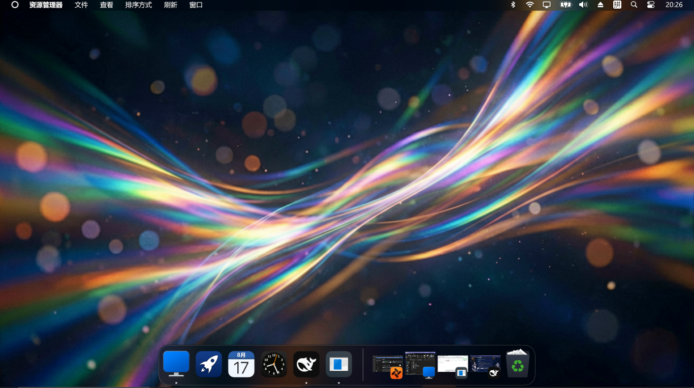

# WinMacStyle — Windows 桌面一键切换 macOS 风格

> 外观 macOS 化，操作方式与功能完全保留 Windows 习惯。
> 双击一下，Windows 桌面秒变苹果风；再双击，完整还原。



## ✨ 功能

| 切换项 | Mac 风格（开启） | Windows 原生（关闭） |
|--------|----------------|---------------------|
| **Dock 栏** | ✅ 底部 macOS 风格 Dock | ❌ 关闭 |
| **桌面图标** | ✅ 隐藏（干净桌面） | ✅ 恢复显示 |
| **Windows 任务栏** | ✅ 自动隐藏（鼠标移到底部滑出） | ✅ 常驻显示 |
| **壁纸** | 🔒 不变（Windows 设置统一管理） | 🔒 不变 |

- **壁纸完全不受影响**：切换风格不会改壁纸，换壁纸仍走 `右键桌面 → 个性化 → 背景`
- **零副作用**：随时开、随时关，不改变任何 Windows 功能与操作习惯
- 想要 macOS 官方壁纸？在背景设置里浏览选择 `wallpaper/macos/` 文件夹即可

## 📦 依赖

需要先安装 **MyDockFinder**（免费）：

- 免费版（推荐）：https://github.com/JIAJIA-nya/MyDockFinder-Free
- 官网：https://www.mydockfinder.com/
- 默认安装在 `D:\MyDockFinder`，脚本会自动检测常见安装位置
- 若装在别处，可用 `-DockDir` 参数指定（见下文）

> MyDockFinder 是第三方软件，仅作为本脚本的运行时依赖，请遵守其自身许可。

## 🚀 快速开始

### 方式一：双击（最简单）

1. 下载本项目并解压
2. 双击 **`Enable-MacStyle.bat`** → 桌面变身 macOS 风格
3. 双击 **`Disable-MacStyle.bat`** → 恢复 Windows 原生

### 方式二：命令行

```powershell
# 开启 Mac 风格
powershell -ExecutionPolicy Bypass -File scripts\WinMacStyle.ps1 -On

# 关闭 Mac 风格
powershell -ExecutionPolicy Bypass -File scripts\WinMacStyle.ps1 -Off

# 指定 MyDockFinder 安装目录
powershell -ExecutionPolicy Bypass -File scripts\WinMacStyle.ps1 -On -DockDir "D:\Tools\MyDockFinder"
```

## 🖼️ 壁纸

本仓库提供 macOS 官方壁纸包（Sonoma / Ventura / Sequoia / Tahoe 等，来源：[LAYTAT/macOS-Wallpapers](https://github.com/LAYTAT/macOS-Wallpapers)）：

- 使用：`右键桌面 → 个性化 → 背景 → 浏览` 选择 `wallpaper/macos/` 里的图片
- 壁纸与风格切换**完全独立**，可任意组合

## 🔧 原理说明

- **桌面图标显隐**：向桌面视图窗口（`SHELLDLL_DefView`）发送 `WM_COMMAND 0x7402` 消息，等价于右键桌面 → 查看 → 显示桌面图标
- **任务栏自动隐藏**：修改注册表 `HKCU\...\Explorer\StuckRects3` 第 9 字节（`03`=自动隐藏 / `02`=常驻），重启 `explorer` 生效
- **explorer 重启**：重启会重置 `HideIcons`，脚本在重启后自动重新同步图标状态

## ⚠️ 注意事项

- 切换过程中任务栏会闪烁一下（重启 explorer 所致），属正常现象
- 需要临时用任务栏时，Mac 模式下把鼠标移到屏幕最底部即可滑出
- 若 MyDockFinder 被安全软件拦截，请添加信任或右键 → 以管理员身份运行
- 建议先备份注册表（脚本仅修改 `HideIcons` 与 `StuckRects3` 两个键）

## 📄 许可证

MIT License，见 [LICENSE](LICENSE)。

## 🙏 致谢

- [MyDockFinder](https://www.mydockfinder.com/) — macOS 风格 Dock
- [LAYTAT/macOS-Wallpapers](https://github.com/LAYTAT/macOS-Wallpapers) — macOS 官方壁纸合集
